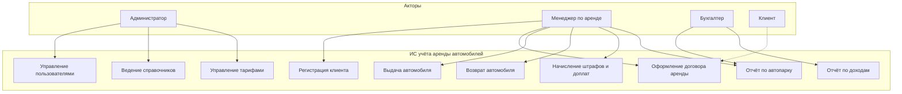
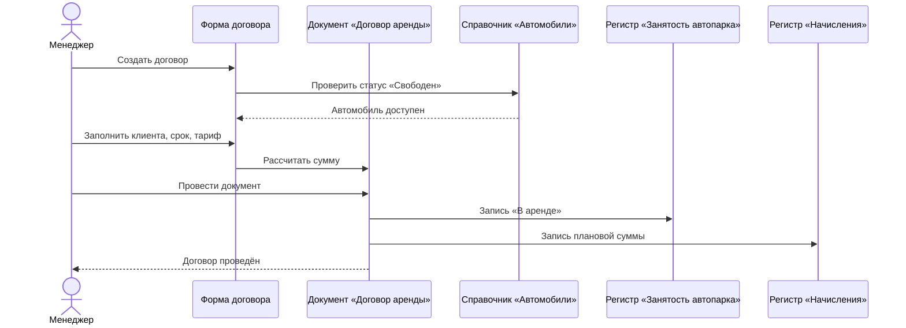
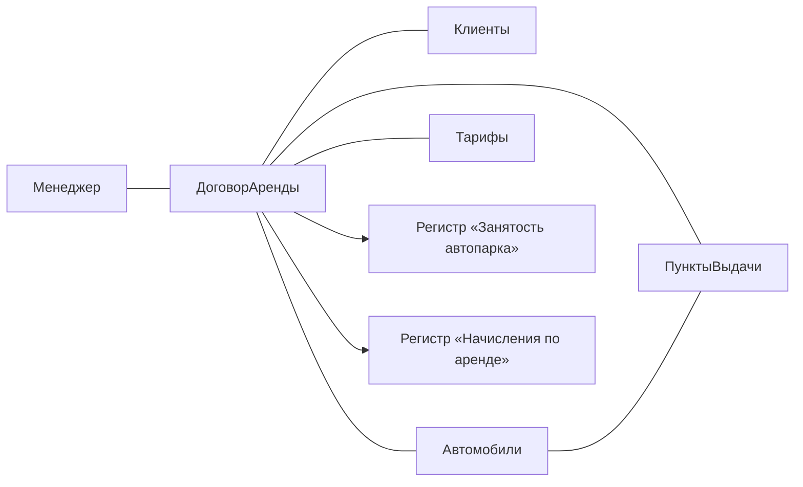
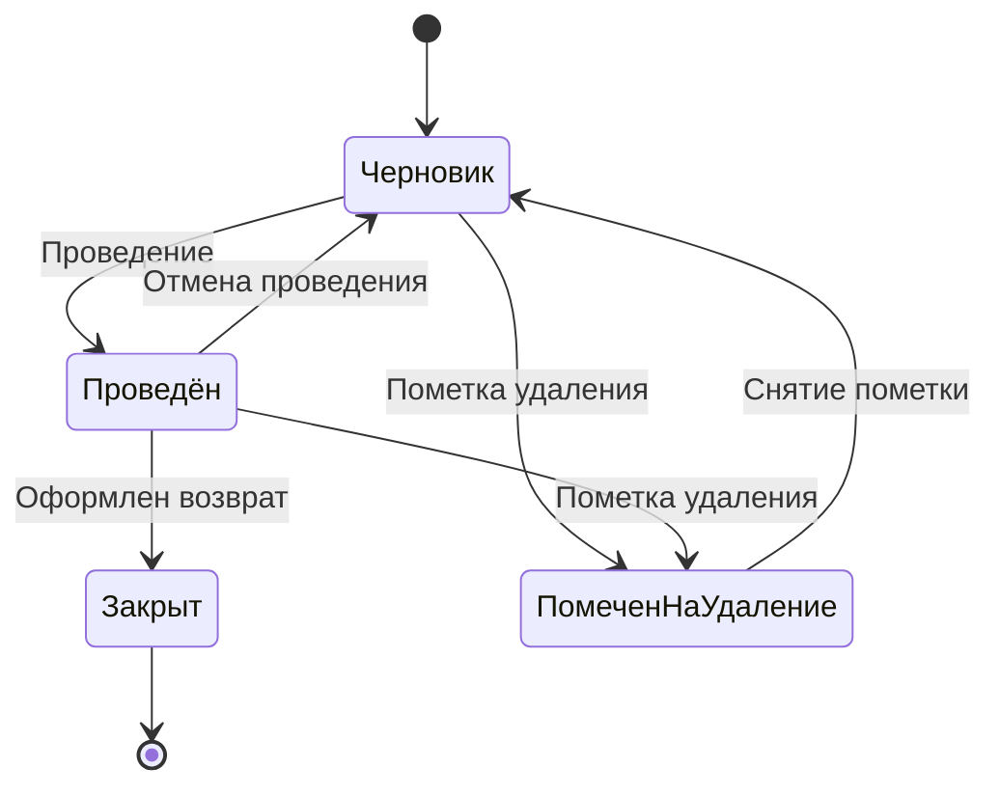
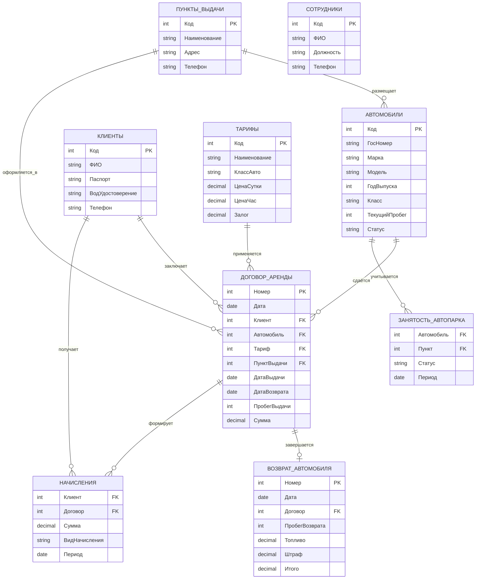
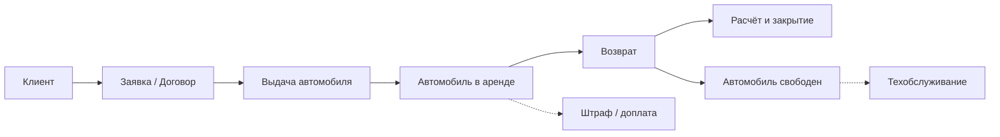

# КУРСОВОЙ ПРОЕКТ

**Тема:** Разработка информационной системы учёта аренды автомобилей на платформе «1С:Предприятие 8.3»

---

## Введение

Данный курсовой проект посвящён разработке информационной системы учёта аренды автомобилей на базе платформы «1С:Предприятие 8.3». В рамках работы решаются задачи автоматизации процессов оформления договоров аренды, контроля состояния автопарка, учёта пробега и начислений, а также проектируется структура базы данных, обеспечивающая целостность и оперативность учётных операций.

**Актуальность темы** курсового проекта обусловлена ростом спроса на услуги краткосрочной и долгосрочной аренды транспортных средств. В современных экономических условиях точность отражения занятости автомобилей, скорость оформления договоров, контроль пробега и своевременный возврат техники напрямую влияют на доходность компании и уровень клиентского сервиса. Ручные методы ведения учёта, основанные на бумажных журналах, Excel-таблицах или разрозненных CRM-системах, не обеспечивают оперативного контроля свободных автомобилей, склонны к ошибкам при расчёте стоимости аренды и не позволяют формировать аналитическую отчётность в реальном времени. В связи с этим внедрение специализированных информационных систем становится объективной необходимостью для автопрокатных компаний.

Платформа «1С:Предприятие 8.3» широко применяется для автоматизации учётных процессов в организациях различного масштаба. Благодаря встроенным механизмам работы с документами, регистрами накопления и гибкой настройке прав доступа, она позволяет быстро создавать конфигурации, адаптированные под конкретные задачи. Для компании по аренде автомобилей внедрение системы учёта на данной платформе обеспечит сокращение времени на оформление договоров, автоматический расчёт стоимости аренды и прозрачность операций с автопарком.

**Объект исследования** — информационные процессы учёта аренды автомобилей в автопрокатной компании.

**Предмет исследования** — информационная система учёта аренды автомобилей, разработанная на платформе «1С:Предприятие 8.3».

**Цель курсового проекта** — разработка информационной системы для автоматизации учёта аренды автомобилей.

Для достижения поставленной цели были сформулированы следующие **задачи**:

1. Провести анализ предметной области аренды автомобилей и движения автопарка.
2. Изучить особенности автоматизации процессов в компаниях по прокату транспортных средств.
3. Определить основные функциональные и технические требования к разрабатываемой информационной системе.
4. Спроектировать структуру базы данных и построить ER-диаграмму системы.

**Методы исследования**, использованные при выполнении работы: теоретический анализ научно-методической литературы и нормативных документов по учёту аренды имущества; сравнительный анализ существующих программных решений; метод структурного моделирования (построение ER-диаграммы, диаграмм UML); проектирование конфигурации на платформе «1С:Предприятие 8.3» с использованием встроенного языка программирования; функциональное тестирование разработанной системы.

**Структура курсового проекта** обусловлена поставленными задачами и состоит из введения, двух логически связанных глав, заключения, списка использованных источников и приложений. В первой главе рассматриваются теоретические аспекты предметной области, формулируются требования к системе и выполняется проектирование структуры данных. Во второй главе описывается процесс практической реализации конфигурации в среде «1С:Предприятие 8.3», включая разработку метаданных, программирование бизнес-логики, настройку интерфейса и тестирование системы.

---

# Глава 1. Анализ предметной области и проектирование ER-диаграммы

## 1.1 Характеристика предметной области аренды автомобилей

Предметная область учёта аренды автомобилей охватывает совокупность взаимосвязанных процессов, обеспечивающих предоставление транспортных средств клиентам на определённый срок с последующим возвратом и расчётом. В условиях работы автопрокатной компании ключевую роль играет своевременное отражение операций бронирования, выдачи, возврата автомобиля, а также контроль технического состояния и фактической занятости каждой единицы автопарка.

Бизнес-процесс аренды можно представить в виде последовательности этапов. Первоначально клиент обращается в компанию или оставляет заявку через сайт, после чего менеджер проверяет наличие свободного автомобиля нужного класса (эконом, комфорт, бизнес, внедорожник). Далее оформляется договор аренды: фиксируются данные клиента, выбранный автомобиль, дата и время выдачи, планируемая дата возврата, тариф, залог и дополнительные услуги (детское кресло, навигатор, дополнительная страховка). При выдаче автомобиля сотрудник фиксирует начальный пробег, уровень топлива и внешнее состояние кузова. В период аренды автомобиль числится как «занятый». При возврате проверяются пробег, топливо, наличие повреждений; при необходимости начисляются штрафы или доплаты. Завершающим этапом является закрытие договора и перевод автомобиля в статус «свободен» либо «на техническом обслуживании».

Отсутствие автоматизированного учёта приводит к системным проблемам: двойному бронированию одного автомобиля, невозможности оперативно узнать свободные машины, ошибкам при расчёте стоимости по тарифам, потере данных о пробеге и повреждениях, сложности контроля просроченных возвратов. Внедрение информационной системы на базе платформы «1С:Предприятие 8.3» позволяет устранить указанные недостатки за счёт централизованного хранения информации, автоматического проведения хозяйственных операций, использования регистров накопления для расчёта показателей в реальном времени и настройки ролевой модели доступа.

Границы разрабатываемой системы включают учёт автопарка, клиентов и тарифов, оформление договоров аренды и возврата, контроль занятости автомобилей, учёт пробега и начислений, формирование аналитической отчётности. Процессы бухгалтерского учёта налогов, ведения расчётных счетов, страхования КАСКО/ОСАГО во внешних системах и управления рекламными кампаниями остаются за пределами автоматизации. На основе проведённого анализа сформированы требования к конфигурации, определяющие состав справочников, документов, регистров и пользовательских интерфейсов.

## 1.2 Определение границ системы и функциональных требований

Для формирования однозначного понимания архитектуры разрабатываемой информационной системы необходимо определить базовый терминологический аппарат:

- **Автомобиль** — единица автопарка, характеризующаяся маркой, моделью, государственным номером, годом выпуска, классом, текущим пробегом и статусом (свободен, в аренде, на ТО, в ремонте).
- **Клиент** — физическое или юридическое лицо, заключающее договор аренды. Содержит ФИО/наименование, паспортные или регистрационные данные, водительское удостоверение, контактный телефон.
- **Тариф** — правило расчёта стоимости аренды в зависимости от класса автомобиля и срока (почасовой, посуточный, понедельный).
- **Пункт выдачи** — структурная единица компании (офис, филиал), где осуществляется выдача и приём автомобилей.
- **Договор аренды** — учётная операция, фиксирующая передачу автомобиля клиенту. Служит основанием для изменения статуса автомобиля и начисления оплаты.
- **Возврат автомобиля** — учётная операция, отражающая завершение аренды, фиксацию конечного пробега, топлива и дополнительных начислений.
- **Регистр накопления** — объект конфигурации «1С:Предприятие 8.3», предназначенный для хранения движений и автоматического расчёта показателей (занятость автопарка, начисления, пробег).
- **Залог** — денежная сумма, удерживаемая при выдаче автомобиля и возвращаемая при отсутствии нарушений.

Введённый терминологический аппарат обеспечивает единое понимание предметной области и создаёт основу для проектирования структуры базы данных.

**Функциональные требования к системе:**

1. Ведение справочников автомобилей, клиентов, тарифов, пунктов выдачи и сотрудников.
2. Оформление договора аренды с автоматическим резервированием автомобиля.
3. Контроль свободных и занятых автомобилей в разрезе пунктов выдачи.
4. Учёт пробега при выдаче и возврате.
5. Автоматический расчёт стоимости аренды по тарифу.
6. Начисление штрафов за просрочку возврата, повреждения, недостачу топлива.
7. Формирование отчётов по автопарку, доходам и загрузке.
8. Разграничение прав доступа по ролям пользователей.

## 1.3 Моделирование сценариев взаимодействия (диаграмма вариантов использования)

Для формализации функциональных требований применяется диаграмма вариантов использования (рисунок 1.1). В конфигурации определены три роли: **Администратор** — управление пользователями, справочниками и настройками; **Менеджер по аренде** — оформление договоров, выдача и приём автомобилей, работа с клиентами; **Бухгалтер** — просмотр начислений, формирование отчётов по доходам.

Ключевые варианты использования: регистрация клиента, оформление договора аренды, выдача автомобиля, возврат автомобиля, начисление штрафов, формирование отчёта по автопарку, отчёта по доходам, управление тарифами.

### Рисунок 1.1 — Диаграмма вариантов использования ИС учёта аренды автомобилей



Анализ диаграммы позволяет определить минимальный набор функций для бесперебойной работы автопроката. Каждый сценарий сопровождается предусловиями (авторизация, наличие свободного автомобиля) и постусловиями (фиксация движения в регистрах «Занятость автопарка» и «Начисления по аренде»).

## 1.4 Моделирование взаимодействия объектов системы

### Рисунок 1.2 — Диаграмма последовательности оформления договора аренды



На диаграмме отражён алгоритм: менеджер создаёт документ «Договор аренды», система проверяет доступность автомобиля, рассчитывает стоимость по тарифу, при проведении формирует движения в регистрах. При нарушении правил (автомобиль занят, не заполнен клиент, отрицательный срок) проведение блокируется.

### Рисунок 1.3 — Диаграмма кооперации оформления договора аренды



Диаграмма кооперации показывает статические связи между объектами конфигурации и регистрами накопления.

## 1.5 Моделирование жизненного цикла документов

### Рисунок 1.4 — Диаграмма состояний документа «Договор аренды»



Документ «Договор аренды» проходит состояния: **Черновик** (без движений по регистрам), **Проведён** (автомобиль зарезервирован/выдан, начислена плановая сумма), **Закрыт** (оформлен возврат, итоговый расчёт выполнен). Переходы регламентируются бизнес-правилами: проведение возможно только при заполнении клиента, автомобиля, дат и тарифа.

## 1.6 Проектирование структуры базы данных и ER-диаграмма

На основе выделенных сущностей выполнено проектирование реляционной структуры базы данных. ER-диаграмма (рисунок 1.5) определяет состав атрибутов, ключи и типы связей.

### Рисунок 1.5 — ER-диаграмма информационной системы учёта аренды автомобилей



В структуре базы данных выделены сущности: **Автомобили**, **Клиенты**, **Тарифы**, **Пункты выдачи**, **Сотрудники**, **Договор аренды**, **Возврат автомобиля**, **Регистр занятости автопарка**, **Регистр начислений**. Связи приведены к третьей нормальной форме.

**Таблица 1.1 — Описание сущностей и атрибутов базы данных**

| Сущность | Назначение | Ключевые атрибуты |
|----------|------------|-------------------|
| Автомобили | Справочник автопарка | Код, Гос. номер, Марка, Модель, Класс, Пробег, Статус |
| Клиенты | Арендаторы | Код, ФИО, Паспорт, Вод. удостоверение, Телефон |
| Тарифы | Правила ценообразования | Код, Класс авто, Цена/сутки, Цена/час, Залог |
| Пункты выдачи | Филиалы компании | Код, Наименование, Адрес |
| Сотрудники | Персонал | Код, ФИО, Должность, Телефон |
| Договор аренды | Оформление аренды | Номер, Дата, Клиент, Автомобиль, Срок, Сумма |
| Возврат автомобиля | Завершение аренды | Номер, Договор, Пробег, Штраф, Итого |
| Занятость автопарка | Регистр — статусы авто | Автомобиль, Пункт, Статус, Период |
| Начисления | Регистр — оплаты | Клиент, Договор, Сумма, Вид начисления |

## 1.7 Выводы по главе 1

В первой главе проведён анализ предметной области аренды автомобилей, определены границы автоматизации и сформулированы функциональные требования. Построены модели: диаграмма вариантов использования (роли — администратор, менеджер, бухгалтер); диаграммы последовательности и кооперации для оформления договора; диаграмма состояний жизненного цикла документа. Спроектирована логическая структура БД и ER-диаграмма. Ключевая особенность модели — регистр «Занятость автопарка», позволяющий в реальном времени видеть свободные и занятые автомобили. Архитектура адаптирована для реализации в «1С:Предприятие 8.3».

---

# Глава 2. Практическая реализация информационной системы учёта аренды автомобилей в среде «1С:Предприятие 8.3»

## 2.1. Создание новой конфигурации и настройка основных объектов метаданных

Разработка началась с запуска конфигуратора «1С:Предприятие 8.3» и создания информационной базы «Аренда автомобилей».

*(Рисунок 2.1 — Окно создания новой конфигурации)*

В дереве метаданных созданы объекты:

**Справочники:**
- Автомобили (марка, модель, гос. номер, класс, пробег, статус)
- Клиенты (ФИО, паспорт, вод. удостоверение, телефон)
- Тарифы (класс, цена за сутки/час, залог)
- ПунктыВыдачи (офисы и филиалы)
- Сотрудники, Должности

*(Рисунки 2.2–2.4 — Структура справочников «Автомобили», «Клиенты», «Тарифы»)*

**Документы:**
- ДоговорАренды (выдача автомобиля клиенту)
- ВозвратАвтомобиля (приём и закрытие договора)
- НачислениеШтрафа (просрочка, повреждения, топливо)
- ПеремещениеАвтомобиля (между пунктами выдачи)

**Регистры накопления:**
- ЗанятостьАвтопарка (свободен / в аренде / на ТО)
- НачисленияПоАренде (плановые и фактические платежи)
- ПробегАвтомобилей (учёт пробега по договорам)

*(Рисунки 2.5–2.7 — Структура регистров накопления)*

## 2.2. Реализация бизнес-логики документов

Основная логика реализована в модулях документов. При проведении «Договора аренды» система проверяет статус автомобиля, рассчитывает сумму по тарифу и количеству суток, формирует движения:

- регистр **ЗанятостьАвтопарка** — запись «В аренде»;
- регистр **НачисленияПоАренде** — плановая сумма;
- регистр **ПробегАвтомобилей** — начальный пробег.

Пример фрагмента процедуры проведения (встроенный язык 1С):

```bsl
Процедура ОбработкаПроведения(Отказ, РежимПроведения)

    // Проверка доступности автомобиля
    Если Автомобиль.Статус <> Перечисления.СтатусыАвто.Свободен Тогда
        Отказ = Истина;
        Сообщить("Автомобиль уже занят!");
        Возврат;
    КонецЕсли;

    // Расчёт суммы
    КоличествоСуток = (ДатаВозврата - ДатаВыдачи) / 86400;
    Сумма = Тариф.ЦенаСутки * КоличествоСуток;

    // Движение по занятости
    Движение = Движения.ЗанятостьАвтопарка.Добавить();
    Движение.ВидДвижения = ВидДвиженияНакопления.Приход;
    Движение.Автомобиль = Автомобиль;
    Движение.Статус = Перечисления.СтатусыАвто.ВАренде;

    // Движение по начислениям
    Движение = Движения.НачисленияПоАренде.Добавить();
    Движение.Клиент = Клиент;
    Движение.Сумма = Сумма;

КонецПроцедуры
```

При проведении «Возврата автомобиля» выполняется обратное движение по занятости, фиксируется конечный пробег, рассчитываются доплаты за перепробег и штрафы.

*(Рисунки 2.8–2.9 — Модуль документа и форма договора)*

## 2.3. Разработка пользовательских форм и интерфейса

Разработаны формы:
- главное рабочее место менеджера (список свободных авто);
- форма документа «Договор аренды» с автоматическим расчётом суммы;
- форма «Возврат автомобиля» с полями пробега и штрафов;
- форма списка клиентов.

*(Рисунки 2.10–2.12 — Скриншоты форм)*

## 2.4. Разработка отчётов с использованием СКД

### 2.4.1. Отчёт «Загрузка автопарка»

Создан отчёт на основе регистра «ЗанятостьАвтопарка». Тип набора данных — «Остатки и обороты». Поля: автомобиль, пункт выдачи, статус, период.

### 2.4.2. Отчёт «Доходы по аренде»

Источник — регистр «НачисленияПоАренде». Группировка по клиентам и автомобилям, итоги по сумме.

### 2.4.3. Параметры отчётов

Добавлены параметры **НачалоПериода** и **КонецПериода** (тип «Дата»).

*(Рисунки 2.13–2.18 — Настройка СКД и результат отчёта)*

## 2.5. Настройка прав доступа и ролей

Реализованы роли:
- **Администратор** — полный доступ;
- **Менеджер** — договоры, выдача, возврат, клиенты;
- **Бухгалтер** — только просмотр начислений и отчёты.

*(Рисунки 2.19–2.20 — Настройка ролей)*

## 2.6. Тестирование системы

Проведено функциональное тестирование:

| № | Сценарий | Ожидаемый результат | Факт | Статус |
|---|----------|---------------------|------|--------|
| 1 | Оформление договора на свободный авто | Статус «В аренде», сумма рассчитана | Совпадает | OK |
| 2 | Повторная выдача того же авто | Ошибка «Автомобиль занят» | Совпадает | OK |
| 3 | Возврат с перепробегом | Начислена доплата | Совпадает | OK |
| 4 | Просрочка возврата | Начислен штраф | Совпадает | OK |
| 5 | Отчёт по автопарку | Корректные остатки | Совпадает | OK |

*(Рисунки 2.21–2.23 — Скриншоты тестов)*

## 2.7. Формирование аналитической отчётности

Разработаны отчёты:
- Загрузка автопарка (свободные/занятые);
- Доходы по аренде за период;
- Пробег по автомобилям;
- Просроченные возвраты.

## 2.8. Особенности эксплуатации и рекомендации

**Преимущества системы:**
- оперативный контроль свободных автомобилей;
- автоматический расчёт стоимости аренды;
- учёт пробега и штрафов;
- разграничение прав сотрудников.

### Рисунок 2.24 — Схема бизнес-процессов в реализованной системе



**Рекомендации по внедрению:** обучение менеджеров, резервное копирование базы, периодическая сверка пробега с фактическим.

---

## Заключение

В ходе выполнения курсового проекта достигнута поставленная цель — разработана информационная система для автоматизации учёта аренды автомобилей на платформе «1С:Предприятие 8.3». Все задачи решены в полном объёме.

В первой главе проанализирована предметная область: выявлены особенности автопроката (контроль занятости, учёт пробега, тарификация, штрафы за просрочку). Сформулированы требования, построены UML-диаграммы и ER-модель.

Во второй главе создана конфигурация «Аренда автомобилей»: справочники, документы, регистры, формы, отчёты СКД, роли пользователей. Реализована бизнес-логика проведения договоров и возвратов. Тестирование подтвердило корректность работы системы.

**Практическая значимость:** система может применяться в небольших автопрокатных компаниях для сокращения времени оформления договоров, исключения двойного бронирования и повышения прозрачности учёта.

**Направления развития:**
1. Интеграция с онлайн-бронированием на сайте.
2. Подключение GPS-трекинга для контроля пробега.
3. Мобильное приложение для осмотра автомобиля при выдаче/возврате.
4. Интеграция с «1С:Бухгалтерия» для проводок.
5. Автоуведомления клиентам о сроке возврата (SMS/e-mail).

---

## Список использованных источников

1. Рогов В.В. «1С:Предприятие 8.3. Практическое пособие разработчика». — М.: 1С-Паблишинг.
2. Габец А.П., Козырев Д.И. «Профессиональная разработка в системе 1С:Предприятие 8». — М.: 1С-Паблишинг.
3. Официальная документация платформы «1С:Предприятие 8.3» [Электронный ресурс]. — URL: https://its.1c.ru/
4. Федеральный закон «О безопасности дорожного движения» от 10.12.1995 № 196-ФЗ.
5. Гражданский кодекс РФ. Глава 34. Аренда.
6. Хомоненко А.Д. «Базы данных». — СПб.: КОРОНА-Век.
7. Фаулер М. «UML. Основы». — СПб.: Символ-Плюс.
8. Методические указания по выполнению курсового проекта (учебное заведение).

---

## Приложения

**Приложение А** — ER-диаграмма (рисунок 1.5)

**Приложение Б** — Диаграмма вариантов использования (рисунок 1.1)

**Приложение В** — Листинг модулей документов

**Приложение Г** — Скриншоты форм и отчётов

---

*Примечание для переноса в Word: скопируйте текст, вставьте диаграммы Mermaid через [mermaid.live](https://mermaid.live) как PNG, подставьте свои скриншоты из 1С вместо заглушек «Рисунок 2.x».*
