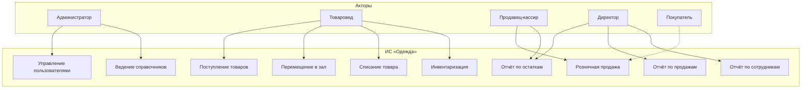
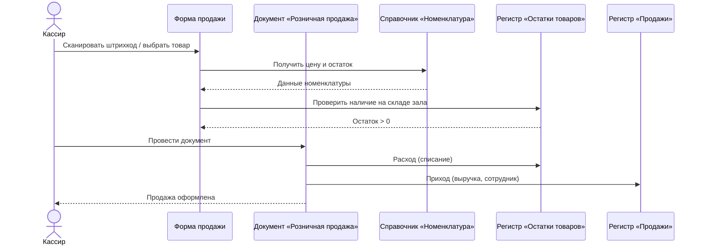
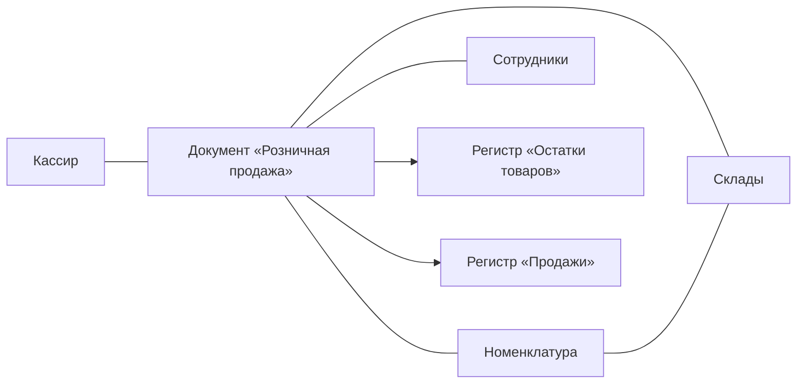
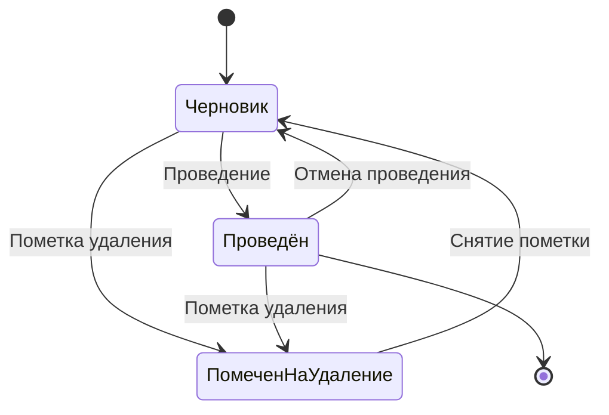
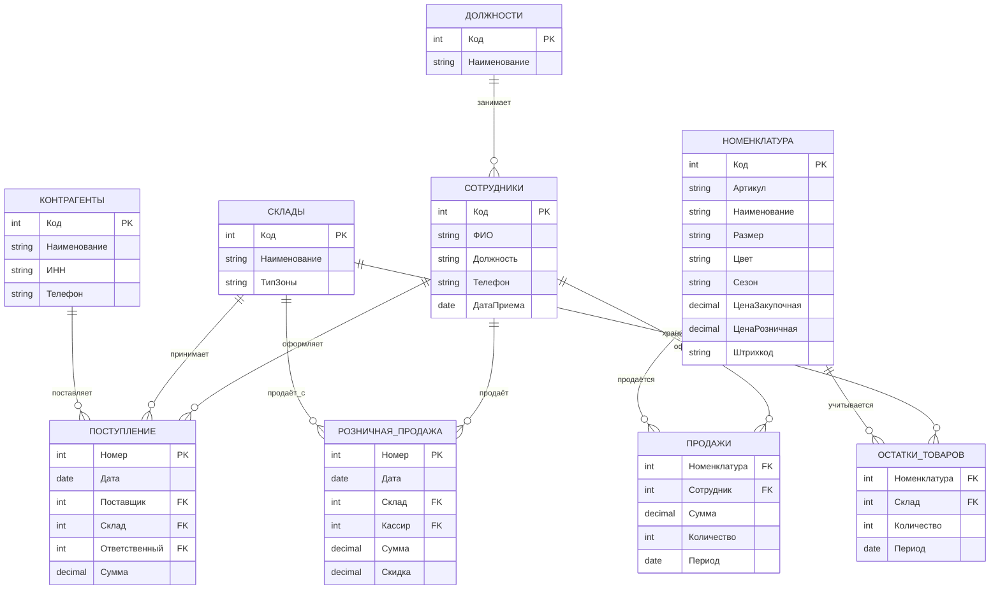
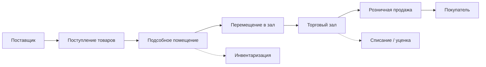

# КУРСОВОЙ ПРОЕКТ

**по МДК 05.02 «Разработка кода информационной системы»**

**Специальность:** 09.02.07 «Информационные системы и программирование»

**Тема:** Разработка информационной системы магазина одежды «Одежда» средствами «1С:Предприятие 8.3»

**Выполнил:** студент 3 курса группы 3ИС-27  
**Ишин Евгений Дмитриевич**

**Руководитель:** Т.М. Иванова

**ГБПОУ г. Москвы «Политехнический колледж им. Н.Н. Годовикова»**  
**Москва — 2026**

---

## СОДЕРЖАНИЕ

Введение  
Глава 1. Анализ предметной области и проектирование информационной системы магазина одежды «Одежда»  
&nbsp;&nbsp;&nbsp;&nbsp;1.1 Характеристика предметной области магазина одежды  
&nbsp;&nbsp;&nbsp;&nbsp;1.2 Управление персоналом и автоматизация процессов в организации  
&nbsp;&nbsp;&nbsp;&nbsp;1.3 Определение границ системы и функциональных требований  
&nbsp;&nbsp;&nbsp;&nbsp;1.4 Моделирование сценариев взаимодействия пользователей с системой  
&nbsp;&nbsp;&nbsp;&nbsp;1.5 Моделирование взаимодействия объектов системы  
&nbsp;&nbsp;&nbsp;&nbsp;1.6 Моделирование жизненного цикла документов  
&nbsp;&nbsp;&nbsp;&nbsp;1.7 Проектирование структуры базы данных и ER-диаграмма  
&nbsp;&nbsp;&nbsp;&nbsp;1.8 Выводы по главе 1  
Глава 2. Практическая реализация информационной системы магазина одежды «Одежда» в среде «1С:Предприятие 8.3»  
&nbsp;&nbsp;&nbsp;&nbsp;2.1 Создание конфигурации и настройка объектов метаданных  
&nbsp;&nbsp;&nbsp;&nbsp;2.2 Реализация бизнес-логики документов  
&nbsp;&nbsp;&nbsp;&nbsp;2.3 Разработка пользовательских форм и интерфейса  
&nbsp;&nbsp;&nbsp;&nbsp;2.4 Разработка отчётов с использованием СКД  
&nbsp;&nbsp;&nbsp;&nbsp;2.5 Настройка прав доступа и учёт персонала  
&nbsp;&nbsp;&nbsp;&nbsp;2.6 Тестирование системы и оценка эффективности  
&nbsp;&nbsp;&nbsp;&nbsp;2.7 Выводы по главе 2  
Заключение  
Список использованных источников  
Приложения  

---

## ВВЕДЕНИЕ

Данный курсовой проект посвящён разработке информационной системы магазина одежды «Одежда» на базе платформы «1С:Предприятие 8.3». В рамках работы решаются задачи автоматизации учёта товаров, оформления поступления и розничной продажи одежды, контроля остатков, а также учёта персонала магазина и разграничения прав доступа сотрудников.

**Актуальность темы** обусловлена необходимостью повышения эффективности работы розничных магазинов одежды. В современных условиях точность учёта товарных остатков в разрезе размеров и артикулов, скорость обслуживания покупателей на кассе, своевременное пополнение ассортимента и корректный учёт работы продавцов напрямую влияют на прибыль предприятия. Ручное ведение учёта в Excel-таблицах и бумажных журналах не обеспечивает оперативного контроля, приводит к ошибкам при инвентаризации и затрудняет анализ продаж. Внедрение специализированной информационной системы позволяет централизовать данные и автоматизировать основные операции магазина.

Платформа «1С:Предприятие 8.3» широко применяется в торговых организациях. Благодаря механизмам документов, регистров накопления и настройке ролей она подходит для создания конфигураций под задачи розничной торговли одеждой.

**Объект исследования** — информационные процессы учёта товаров и управления персоналом в магазине одежды.

**Предмет исследования** — информационная система магазина одежды «Одежда», разработанная на платформе «1С:Предприятие 8.3».

**Цель курсового проекта** — разработка информационной системы для автоматизации деятельности магазина одежды «Одежда».

**Задачи курсового проекта** (в соответствии с заданием):

1. Провести анализ предметной области управления персоналом и торговых процессов магазина одежды.
2. Изучить особенности автоматизации процессов в организациях розничной торговли.
3. Определить основные требования к разрабатываемой информационной системе.
4. Спроектировать структуру базы данных и построить ER-диаграмму системы.
5. Реализовать информационную систему на платформе «1С:Предприятие 8.3».
6. Провести тестирование разработанной системы и оценить эффективность её использования.

**Методы исследования:** анализ научно-методической литературы; сравнительный анализ программных решений; структурное моделирование (ER-диаграмма, UML); проектирование и программирование конфигурации «1С:Предприятие 8.3»; функциональное тестирование.

**Структура работы:** введение, две главы, заключение, список источников и приложения. Первая глава — теоретическая часть (анализ, требования, проектирование БД). Вторая глава — практическая реализация и тестирование в 1С.

**Сроки выполнения** (по заданию): введение — 05.05–19.05.2026; теоретическая часть — 20.05–02.06.2026; практическая часть — 02.06–09.06.2026; заключение — 10.06–16.06.2026.

---

# ГЛАВА 1. АНАЛИЗ ПРЕДМЕТНОЙ ОБЛАСТИ И ПРОЕКТИРОВАНИЕ ИНФОРМАЦИОННОЙ СИСТЕМЫ МАГАЗИНА ОДЕЖДЫ «ОДЕЖДА»

## 1.1 Характеристика предметной области магазина одежды

Предметная область магазина одежды «Одежда» охватывает процессы закупки, хранения, выкладки и продажи товаров народного потребления: верхней одежды, повседневной одежды, аксессуаров и сопутствующих товаров. В отличие от продовольственных магазинов, учёт одежды требует ведения номенклатуры в разрезе **артикула, размера, цвета, сезона и коллекции**, что усложняет контроль остатков.

Типичный бизнес-процесс магазина включает следующие этапы:

1. **Закупка** — формирование заказа поставщику на основе анализа продаж и остатков.
2. **Поступление** — приёмка товара на склад магазина, сверка с накладной, оприходование.
3. **Выкладка** — перемещение товара из подсобного помещения в торговый зал.
4. **Розничная продажа** — оформление чека покупателю, списание с остатков.
5. **Возврат от покупателя** — приём товара обратно при наличии чека.
6. **Списание** — уценка или списание бракованного/устаревшего товара.
7. **Инвентаризация** — сверка фактических и учётных остатков.

Без автоматизации возникают типичные проблемы: продажа отсутствующего размера, дублирование артикулов в учёте, невозможность быстро узнать остаток по конкретной модели, ошибки кассиров при ручном расчёте скидок, длительная инвентаризация. Информационная система на базе «1С:Предприятие 8.3» позволяет устранить эти недостатки.

**Границы системы** включают: учёт номенклатуры одежды, документы поступления и продажи, контроль остатков, учёт сотрудников и их ролей, отчётность по продажам и остаткам. За пределами системы остаются: полноценный бухгалтерский и налоговый учёт, расчёт заработной платы, онлайн-витрина интернет-магазина.

## 1.2 Управление персоналом и автоматизация процессов в организации

Согласно заданию на курсовой проект, отдельное внимание уделяется анализу предметной области **управления персоналом**. В магазине одежды «Одежда» трудятся сотрудники различных должностей:

| Должность | Основные обязанности |
|-----------|---------------------|
| Директор магазина | Общее руководство, аналитика, настройка системы |
| Администратор | Управление пользователями, справочниками, тарифами скидок |
| Товаровед | Приёмка товара, инвентаризация, контроль остатков |
| Продавец-кассир | Розничные продажи, консультация покупателей |
| Кладовщик | Хранение товара в подсобке, перемещение в зал |

**Управление персоналом** в контексте разрабатываемой ИС включает:

- ведение справочника **Сотрудники** (ФИО, должность, контакты, дата приёма);
- привязку пользователей системы к конкретным сотрудникам;
- **разграничение прав доступа** по ролям (кассир не может редактировать справочник цен, товаровед не имеет доступа к настройкам);
- фиксацию **ответственного лица** в документах (кто оформил поступление, кто провёл продажу);
- формирование отчёта **«Продажи по сотрудникам»** для оценки эффективности работы продавцов.

**Особенности автоматизации в розничных организациях:**

- необходимость работы в режиме реального времени (остатки обновляются при каждой продаже);
- поддержка **штрихкодов** и быстрого поиска номенклатуры;
- гибкое **ценообразование** (розничная цена, скидки, акции);
- простой интерфейс для кассиров с минимальным количеством действий;
- надёжное **разграничение полномочий** для предотвращения мошенничества;
- формирование отчётов для руководства без привлечения программиста (СКД).

## 1.3 Определение границ системы и функциональных требований

**Терминологический аппарат:**

- **Номенклатура** — товар магазина (наименование, артикул, размер, цвет, сезон, цена).
- **Склад / Торговый зал** — место хранения (подсобное помещение, зал).
- **Документ поступления** — оприходование товара от поставщика.
- **Документ розничной продажи** — оформление продажи покупателю.
- **Регистр накопления «Остатки товаров»** — хранение движений и расчёт текущих остатков.
- **Регистр накопления «Продажи»** — учёт выручки в разрезе номенклатуры и сотрудников.
- **Сотрудник** — работник магазина, имеющий учётную запись в системе.

**Функциональные требования:**

1. Ведение справочников: номенклатура, склады, контрагенты, сотрудники, должности.
2. Оформление поступления товаров от поставщиков.
3. Оформление розничных продаж с автоматическим списанием остатков.
4. Перемещение товаров между складом и торговым залом.
5. Списание и уценка товара.
6. Инвентаризация с корректировкой остатков.
7. Учёт сотрудников и разграничение прав по ролям.
8. Отчёты: остатки, продажи, выручка по периодам, продажи по сотрудникам.

**Нефункциональные требования:** платформа 1С 8.3, русскоязычный интерфейс, время отклика при продаже не более 2–3 секунд, резервное копирование базы.

## 1.4 Моделирование сценариев взаимодействия пользователей с системой

На рисунке 1.1 представлена диаграмма вариантов использования.

### Рисунок 1.1 — Диаграмма вариантов использования ИС магазина одежды «Одежда»



**Роли и сценарии:**

- **Администратор** — пользователи, справочники, настройки.
- **Товаровед** — поступление, перемещение, списание, инвентаризация.
- **Продавец-кассир** — розничная продажа, просмотр остатков.
- **Директор** — аналитические отчёты, контроль персонала.

## 1.5 Моделирование взаимодействия объектов системы

### Рисунок 1.2 — Диаграмма последовательности оформления розничной продажи



### Рисунок 1.3 — Диаграмма кооперации оформления розничной продажи



## 1.6 Моделирование жизненного цикла документов

### Рисунок 1.4 — Диаграмма состояний документов учёта товаров



Документы «Поступление товаров» и «Розничная продажа» проходят стандартный цикл 1С: **Черновик** → **Проведён** → при необходимости **Отмена проведения** или **Пометка на удаление**. Проведение формирует движения по регистрам накопления.

## 1.7 Проектирование структуры базы данных и ER-диаграмма

### Рисунок 1.5 — ER-диаграмма информационной системы магазина одежды «Одежда»



**Таблица 1.1 — Описание сущностей и атрибутов базы данных**

| Сущность | Назначение | Ключевые атрибуты |
|----------|------------|-------------------|
| Номенклатура | Справочник одежды | Код, Артикул, Наименование, Размер, Цвет, Цена |
| Склады | Места хранения | Код, Наименование, Тип (подсобка/зал) |
| Контрагенты | Поставщики | Код, Наименование, ИНН, Телефон |
| Сотрудники | Персонал магазина | Код, ФИО, Должность, Дата приёма |
| Должности | Должности персонала | Код, Наименование |
| Поступление товаров | Приход от поставщика | Номер, Дата, Поставщик, Склад, Сумма |
| Розничная продажа | Продажа покупателю | Номер, Дата, Кассир, Сумма, Скидка |
| Остатки товаров | Регистр остатков | Номенклатура, Склад, Количество |
| Продажи | Регистр выручки | Номенклатура, Сотрудник, Сумма, Количество |

Связи между сущностями приведены к **третьей нормальной форме (3НФ)**.

## 1.8 Выводы по главе 1

В первой главе проведён анализ предметной области магазина одежды «Одежда» и процессов управления персоналом. Определены границы системы и функциональные требования. Построены диаграммы вариантов использования, последовательности, кооперации и состояний. Спроектирована структура БД и ER-диаграмма. Сформирована теоретическая база для практической реализации во второй главе.

---

# ГЛАВА 2. ПРАКТИЧЕСКАЯ РЕАЛИЗАЦИЯ ИНФОРМАЦИОННОЙ СИСТЕМЫ МАГАЗИНА ОДЕЖДЫ «ОДЕЖДА» В СРЕДЕ «1С:ПРЕДПРИЯТИЕ 8.3»

## 2.1 Создание конфигурации и настройка объектов метаданных

Разработка начата с создания новой информационной базы **«Одежда»** в конфигураторе «1С:Предприятие 8.3».

*(Рисунок 2.1 — Окно создания новой конфигурации)*

**Справочники:**

| Справочник | Основные реквизиты |
|------------|-------------------|
| Номенклатура | Артикул, Наименование, Размер, Цвет, Сезон, ЦенаЗакупочная, ЦенаРозничная, Штрихкод |
| Склады | Наименование, ТипЗоны (Подсобка / Торговый зал) |
| Контрагенты | Наименование, ИНН, Телефон, Адрес |
| Сотрудники | ФИО, Должность, Телефон, ДатаПриема |
| Должности | Наименование |

*(Рисунки 2.2–2.5 — Структура справочников «Номенклатура», «Склады», «Сотрудники»)*

**Документы:**

- **ПоступлениеТоваров** — приход от поставщика;
- **РозничнаяПродажа** — продажа покупателю;
- **ПеремещениеТоваров** — из подсобки в торговый зал;
- **СписаниеТоваров** — брак, уценка;
- **Инвентаризация** — пересчёт остатков.

**Регистры накопления:**

- **ОстаткиТоваров** — измерения: Номенклатура, Склад; ресурс: Количество;
- **ПродажиТоваров** — измерения: Номенклатура, Сотрудник; ресурсы: Количество, Сумма.

*(Рисунки 2.6–2.7 — Структура регистров накопления)*

## 2.2 Реализация бизнес-логики документов

Бизнес-логика реализована в модулях объектов документов.

**Поступление товаров** — при проведении формирует приход по регистру «ОстаткиТоваров».

**Розничная продажа** — проверяет остаток в торговом зале, рассчитывает сумму с учётом скидки, формирует расход по остаткам и приход по продажам с фиксацией кассира.

Фрагмент процедуры проведения документа «Розничная продажа»:

```bsl
Процедура ОбработкаПроведения(Отказ, РежимПроведения)

    Для Каждого Строка Из Товары Цикл

        // Проверка остатка
        Остаток = ПолучитьОстаток(Строка.Номенклатура, Склад);
        Если Остаток < Строка.Количество Тогда
            Отказ = Истина;
            Сообщить("Недостаточно товара: " + Строка.Номенклатура);
            Возврат;
        КонецЕсли;

        // Списание с остатков
        Движение = Движения.ОстаткиТоваров.Добавить();
        Движение.ВидДвижения = ВидДвиженияНакопления.Расход;
        Движение.Номенклатура = Строка.Номенклатура;
        Движение.Склад = Склад;
        Движение.Количество = Строка.Количество;

        // Учёт продажи и сотрудника
        Движение = Движения.ПродажиТоваров.Добавить();
        Движение.Номенклатура = Строка.Номенклатура;
        Движение.Сотрудник = Ответственный;
        Движение.Количество = Строка.Количество;
        Движение.Сумма = Строка.Сумма;

    КонецЦикла;

КонецПроцедуры
```

*(Рисунки 2.8–2.9 — Модуль документа и форма розничной продажи)*

## 2.3 Разработка пользовательских форм и интерфейса

Разработаны формы:

1. **Главное рабочее место кассира** — быстрый поиск по штрихкоду, итоговая сумма, кнопка «Пробить чек».
2. **Форма «Поступление товаров»** — табличная часть с номенклатурой, количеством и ценой.
3. **Форма «Розничная продажа»** — автоматический расчёт суммы и скидки.
4. **Форма списка «Номенклатура»** — с группировкой по сезону и виду одежды.
5. **Форма списка «Сотрудники»** — для кадрового учёта.

*(Рисунки 2.10–2.12 — Скриншоты форм)*

## 2.4 Разработка отчётов с использованием СКД

Отчёты созданы в **Системе компоновки данных (СКД)** без написания кода.

### 2.4.1. Отчёт «Остатки товаров»

- Источник: регистр «ОстаткиТоваров»;
- Тип набора данных: «Остатки и обороты»;
- Группировка: Склад → Номенклатура;
- Параметры: НачалоПериода, КонецПериода.

### 2.4.2. Отчёт «Продажи по номенклатуре»

- Источник: регистр «ПродажиТоваров»;
- Итоги по сумме и количеству.

### 2.4.3. Отчёт «Продажи по сотрудникам»

- Группировка по полю «Сотрудник»;
- Позволяет директору оценить работу продавцов.

*(Рисунки 2.13–2.18 — Настройка СКД и результаты отчётов)*

## 2.5 Настройка прав доступа и учёт персонала

Реализованы роли:

| Роль | Права |
|------|-------|
| Администратор | Полный доступ, управление пользователями |
| Товаровед | Поступление, перемещение, списание, инвентаризация |
| Кассир | Только розничная продажа и просмотр остатков |
| Директор | Просмотр всех данных, все отчёты |

Каждый пользователь привязан к элементу справочника **Сотрудники**, что обеспечивает учёт персонала и фиксацию ответственного в документах.

*(Рисунки 2.19–2.20 — Настройка ролей «Кассир» и «Товаровед»)*

## 2.6 Тестирование системы и оценка эффективности

### Таблица 2.1 — Результаты функционального тестирования

| № | Тестовый сценарий | Ожидаемый результат | Фактический результат | Статус |
|---|-------------------|---------------------|------------------------|--------|
| 1 | Поступление 10 ед. товара | Остаток +10 | Остаток +10 | ✓ |
| 2 | Продажа 3 ед. | Остаток −3, запись в «Продажи» | Совпадает | ✓ |
| 3 | Продажа больше остатка | Ошибка, проведение запрещено | Совпадает | ✓ |
| 4 | Перемещение в торговый зал | Остаток в зале увеличился | Совпадает | ✓ |
| 5 | Отчёт «Остатки» | Корректные данные | Совпадает | ✓ |
| 6 | Кассир открывает «Поступление» | Доступ запрещён | Совпадает | ✓ |
| 7 | Отчёт «Продажи по сотрудникам» | Выручка по кассирам | Совпадает | ✓ |

*(Рисунки 2.21–2.23 — Скриншоты тестирования)*

### Оценка эффективности использования

По результатам тестирования и сравнения с ручным учётом выявлено:

| Показатель | До внедрения (ручной учёт) | После внедрения (ИС «Одежда») |
|------------|---------------------------|-------------------------------|
| Время оформления продажи | 3–5 мин. | 30–60 сек. |
| Время инвентаризации (100 позиций) | 4–6 часов | 1,5–2 часа |
| Ошибки при расчёте скидок | 5–8% операций | Менее 1% |
| Получение отчёта по остаткам | 1–2 часа (вручную) | 10–15 сек. |
| Контроль действий сотрудников | Отсутствует | Реализован через роли |

**Вывод:** внедрение ИС повышает оперативность учёта, снижает количество ошибок и обеспечивает прозрачность работы персонала.

### Рисунок 2.24 — Схема бизнес-процессов в реализованной системе



## 2.7 Выводы по главе 2

Во второй главе создана конфигурация «Одежда», реализованы справочники, документы, регистры, формы и отчёты. Настроены роли для учёта персонала. Тестирование подтвердило корректность работы системы. Оценка эффективности показала сокращение времени на ключевые операции.

---

## ЗАКЛЮЧЕНИЕ

В ходе выполнения курсового проекта достигнута поставленная цель — разработана информационная система магазина одежды «Одежда» на платформе «1С:Предприятие 8.3».

**По задачам задания:**

1. Проведён анализ предметной области торговли одеждой и управления персоналом магазина.
2. Изучены особенности автоматизации розничных процессов.
3. Определены функциональные и нефункциональные требования к системе.
4. Спроектирована структура БД, построена ER-диаграмма, таблицы приведены к 3НФ.
5. Реализована конфигурация: 5 справочников, 5 документов, 2 регистра накопления, 4 роли, 3 отчёта СКД.
6. Проведено тестирование; эффективность подтверждена сокращением времени операций и снижением ошибок.

**Практическая значимость:** система применима в небольших магазинах одежды для автоматизации учёта товаров и контроля работы продавцов.

**Направления развития:**

1. Подключение онлайн-кассы (54-ФЗ).
2. Интеграция со сканером штрихкодов.
3. Модуль программы лояльности (дисконтные карты).
4. Выгрузка данных в «1С:Бухгалтерия».
5. Мобильное приложение для инвентаризации.

Таким образом, цель курсового проекта достигнута, все задачи из задания выполнены.

---

## СПИСОК ИСПОЛЬЗОВАННЫХ ИСТОЧНИКОВ

1. Рогов В.В. «1С:Предприятие 8.3. Практическое пособие разработчика». — М.: 1С-Паблишинг.
2. Габец А.П., Козырев Д.И. «Профессиональная разработка в системе 1С:Предприятие 8». — М.: 1С-Паблишинг.
3. Хрусталева Т.Ю. «Разработка информационных систем». — М.: Академия.
4. Официальная документация платформы «1С:Предприятие 8.3» [Электронный ресурс]. — URL: https://its.1c.ru/
5. Гражданский кодекс РФ. Часть II. § 3. Договор розничной купли-продажи.
6. Федеральный закон от 22.05.2003 № 54-ФЗ «О применении контрольно-кассовой техники».
7. Хомоненко А.Д., Тимофеев М.Г. «Базы данных». — СПб.: Корона-Век.
8. Фаулер М. «UML. Основы». — СПб.: Символ-Плюс.
9. Методические указания по выполнению курсового проекта. — М.: Политехнический колледж им. Н.Н. Годовикова, 2026.

---

## ПРИЛОЖЕНИЯ

**Приложение А** — ER-диаграмма (рисунок 1.5)  
**Приложение Б** — Диаграмма вариантов использования (рисунок 1.1)  
**Приложение В** — Листинг модулей документов  
**Приложение Г** — Скриншоты форм и отчётов из 1С  
**Приложение Д** — Задание на курсовой проект  

---

### Инструкция по переносу в Word

1. Скопируйте текст в Word, оформите по ГОСТ вашего колледжа (шрифт Times New Roman 14, интервал 1,5, поля).
2. Диаграммы Mermaid → PNG через [mermaid.live](https://mermaid.live) → вставить как рисунки.
3. Заглушки «Рисунок 2.x» заменить скриншотами из вашей базы 1С.
4. На титульный лист поставить логотип колледжа по образцу методички.
